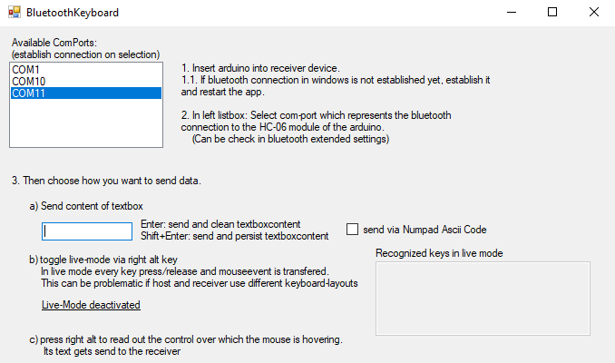

# BluetoothKeyboard
This project allows you to send mouse and keyboard input to another device using an arduino+bluetooth connection.
As the receiver receives those inputs as if it was a real keyboard/mouse, it will work in any state of the receiver, e.g. in login maks, bitlocker, admin prompts, smartphone etc.
Its basically an rubber-ducky with live-input

This project is based on an implementation with an arduino micro pro connected via software-serial with an HC-06 bluetooth module.

The connection goes: Host-PC: vb.net application -> connects via bluetooth serial port to HC-06 model -> hardwired to arduino -> plugged into usb slot of receiver

Also the data transfered in the bluetooth connection is encrpyted by a self written algorythm. (The standard ones take to many ressources)
Although this is currently only done symetrically. So if you care about this, you should change the hardcoded keys.

